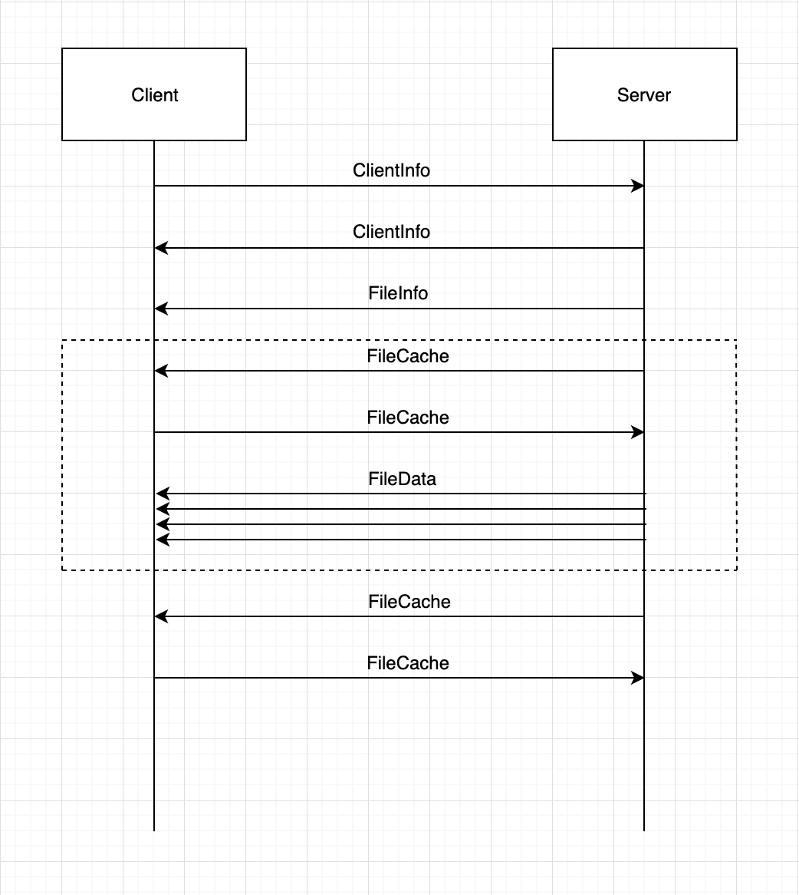
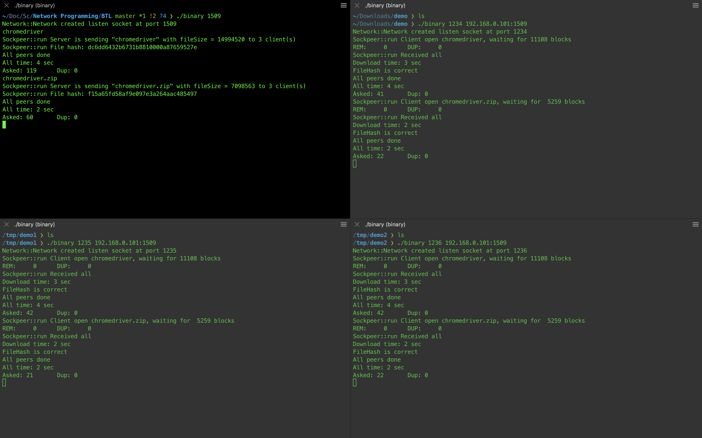

# Bài tập lớn lập trình mạng

Tên sinh viên: Trần Tuấn Minh

MSV: 15021754

### Bài toán:

- Server: S1

- Client: C1, C2, C3

- Server cần truyền 2 file (1-10MB) đến Client(s)

- Người dùng nhập tên file cần truyền tại Server, đánh dấu mốc thời gian (1)

- Sau khi Client(s) nhận được hết file, hiện thời gian (2)

- Client(s) có thể gửi dữ liệu cho nhau

- Checksum sau khi nhận file

- Thời gian = (2) - (1)

### Thiết kế giao thức:

1. Các máy đồng thời tạo socket lắng nghe tại port định nghĩa trước, port này dùng chung cho tất cả user (?)

2. Server được bật lên đầu tiên, khởi tạo môi trường mạng

3. Connect
	- Client(s) kết nối đến Server, cập nhật Server vào danh sách ClientInfo
	- Server gửi danh sách ClientInfo, đồng thời cập nhật Client vào danh sách của mình
	- Client(s) nhận danh sách ClientInfo của Server, cập nhật lại ClientInfo của mình

4. File transfer
	- Server in ra danh sách tên file có thể gửi
	- Server nhập tên file, bắt đầu tính thời gian (1)
	- Server gửi thông tin sẽ chuyển file đến Client(s): {tên file, checksum, dung lượng file}
	- Server sẽ gửi lần lượt các packet: block[i] -> Client[i%3]

5. Extra
	- [√] Client sau khi nhận được packet, gửi packet đó đến cho Client khác
	- [√] Nếu không nhận được block nào từ Server, Client bắt đầu hỏi các packet còn thiếu theo exponential backoff
	- [√] Khi Client nhận được đủ file, thông báo cho Client khác biết, in ra thời gian (2)
	- [√] Khi tất cả Client nhận được đủ file, dừng và nhận lệnh tiếp theo

### Protocol:



### Message Type:
```
message MessageType {
	enum Message {
		HOSTINFO = 0;
		CLIENTINFO = 1;
		FILEINFO = 2;
		FILEDATA = 3;
		COMMONREPLY = 4;
	}
	Message message = 1;
	uint32 localPort = 2;
}
```
Trường này dùng để mổ tả message chính trao đổi qua lại giữa các peer

|Nội dung|Diễn giải|Ghi chú|
|-----------|-----------|-----------|
|message|loại message tiếp theo| |
|localPort|port của peer gửi| |

### Host Info:
```
message HostInfo {
	string host = 1;
	uint32 port = 2;
	bool isSeeder = 3;
}
```
Trường này để lưu thông tin của các peer

|Nội dung|Diễn giải|Ghi chú|
|-----------|-----------|-----------|
|host|listen address của peer| |
|port|listen port của peer| |
|isSeeder|host này là seeder hay peer| |

### Client Info:
```
message ClientInfo {
	string remoteHost = 1;
	uint32 localPort = 2;
	bool isSeeder = 3;
	repeated HostInfo peers = 4;
}
```

Trường này để lưu thông tin các peer trong mạng tại mỗi client

|Nội dung|Diễn giải|Ghi chú|
|-----------|-----------|-----------|
|remoteHost|ip của máy được gửi đến| |
|localPort|listen port của client gửi gói tin này| |
|isSeeder|host này là seeder hay peer| |
|peers|mảng các HostInfo lưu thông tin các peer| | 

### File Info:
```
message FileInfo {
	string filehash = 1;
	string fileName = 2;
	uint32 fileSize = 3;
}
```

Server sẽ gửi trường này để báo với Client sẽ gửi File

|Nội dung|Diễn giải|Ghi chú|
|-----------|-----------|-----------|
|filehash|mã hash của file| |
|fileName|tên file| |
|fileSize|dung lượng file| |

### File Data:
```
message FileData {
	string fileName = 1;
	uint32 offset = 2;
	bytes data = 3;
}
```

Các peer sẽ trao đổi dữ liệu qua FileData

|Nội dung|Diễn giải|Ghi chú|
|-----------|-----------|-----------|
|fileName|tên file| |
|offset|điểm bắt đầu của dữ liệu| |
|data|dữ liệu| |

### File Cache:
```
message FileCache {
	bool isSeeder = 1;
	repeated uint32 cache = 2;
}
```

Server hoặc Seeder sẽ hỏi các Client hay Peer xung quanh, Peer nếu đang trong trạng thái nhận sẽ gửi danh sách các block chưa được nhận (cache) cho Seeder. 

|Nội dung|Diễn giải|Ghi chú|
|-----------|-----------|-----------|
|isSeeder|Peer hỏi là Client hay Server| |
|cache|danh sách các block cần hỏi| |

### Message structure:

Tất cả các message gửi lên server sẽ có cấu trúc như sau

|Message type size (varint encoded)|MessageType|Message size (varint encoded)|Message|
|-----------|-----------|-----------|-----------|
|Trường này chứa size của message type, varint encoded|MessageType được định nghĩa phía trên|Trường này chứa size của message chính, varint encoded|Message chính được gửi lên cho server|

### Demo:



Lưu ý: Cần phải có protobuf trước khi build/run

### Tài liệu tham khảo & Các kĩ thuật sử dụng:

https://stackoverflow.com/questions/14998261/2-way-udp-chat-application

https://stackoverflow.com/questions/17925051/fast-textfile-reading-in-c

https://en.wikipedia.org/wiki/Exponential_backoff

https://developers.google.com/protocol-buffers
